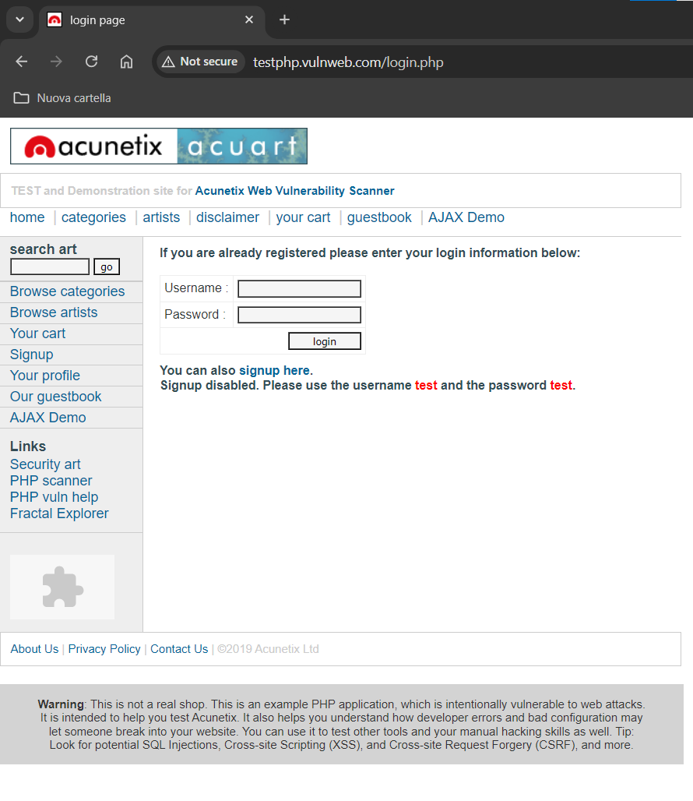
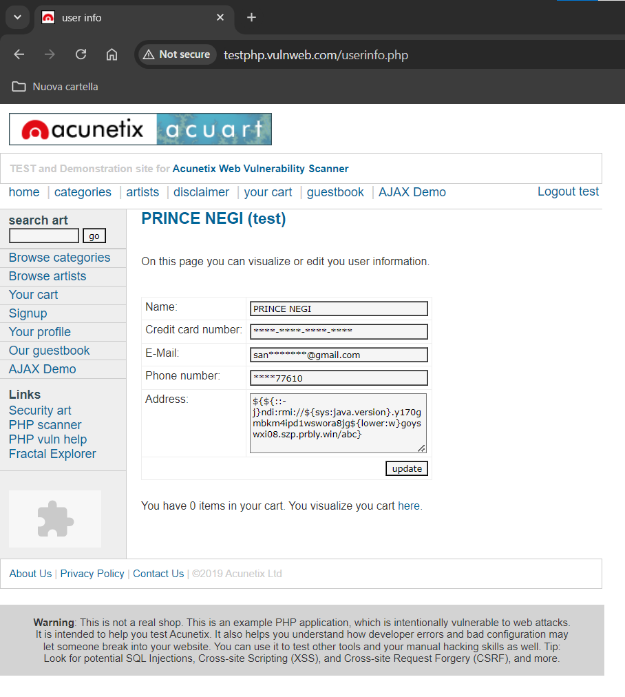

# burpsuite
* This project aims to demonstrate how to properly install and configure BurpSuite and to show some basic commands of this software.
* This project was done on Windows 10
* BurpSuite was configured to work with Google Chrome
* We used the `Community` edition (version `2024.6.6`) of BurpSuite, which is free

BurpSuite is a software for Penetration Testing of Web Applications. BurpSuite can intercept browser traffic, displaying the HTTP scripts of requests.

Additionally, it is possible to send HTTP requests directly from BurpSuite, as shown in [/main/repeater](https://github.com/enricomaiolo/burpsuite/tree/main/repeater). This is particularly useful for performing Brute Force attacks, as demonstrated in [/main/intruder](https://github.com/enricomaiolo/burpsuite/tree/main/intruder).

BurpSuite operates through a proxy, so it is necessary to configure your browser to redirect traffic to this proxy. This configuration was done in [/main/installation](https://github.com/enricomaiolo/burpsuite/tree/main/installation).

To test all these functionalities, we used [vulnweb](http://testphp.vulnweb.com/login.php):

From the main screen, it is possible to attempt logins, and we are told that the correct credentials are `test:test`. Using these credentials, we log in:

