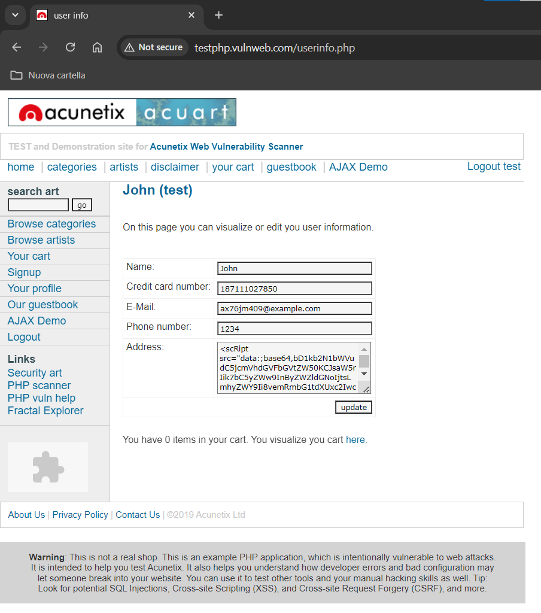

# Objective
Exploit BurpSuite to perform an SQL Injection attack

# Useful Links
* [http://testphp.vulnweb.com/login.php](http://testphp.vulnweb.com/login.php)

# Finding Vulnerabilities
BurpSuite can also be useful for SQL Injection (SQLi) attacks. Let's see how, using [vulnweb](http://testphp.vulnweb.com/login.php), which is a website specifically designed to be vulnerable to SQLi attacks.

To proceed with an SQLi attack, we start by looking for vulnerabilities from the browser. When we try to log in using incorrect credentials like `aaa:bbb`, vulnweb does not show any message on screen. We try inserting special characters like `':bbb`:

Again, nothing appears on the screen. So, the website does not seem to have vulnerabilities visible from the browser.

Let's check with BurpSuite, where we can view the HTTP scripts of the website's responses. We use the `Repeater` to send the login request. Using the credentials `aaa:bbb`, we see that the response contains a message saying `you must login`:

If we use the credentials `':bbb` instead, the response changes and shows an SQL error:

So, through BurpSuite, we managed to find a vulnerability for an SQLi attack. We can use the information contained in the error message from the response to carry out the attack.

# Performing the Attack
When entering the credentials `aaa:bbb` from the browser, we assume that vulnweb executes a query like:

* `SELECT * FROM ? WHERE uname='aaa' & pass='bbb'`

Therefore, by entering the username `aaa' OR 1=1#` from the browser, the query becomes:

* `SELECT * FROM ? WHERE uname='aaa' OR 1=1# & pass='bbb'`

In this way, the condition for the username is always true due to the `OR 1=1` filter. The password condition will always be validated, no matter what it is, because the query is commented out after `#`.

Knowing this, we proceed with the attack through the browser:

The attack works, and we manage to log in:

We can also perform the attack directly from BurpSuite's `Repeater`:

In this case, we need to adhere to URL Encoding syntax, entering the username as `aaa'+OR+1=1#`. Reading the response, we confirm that we successfully logged in.