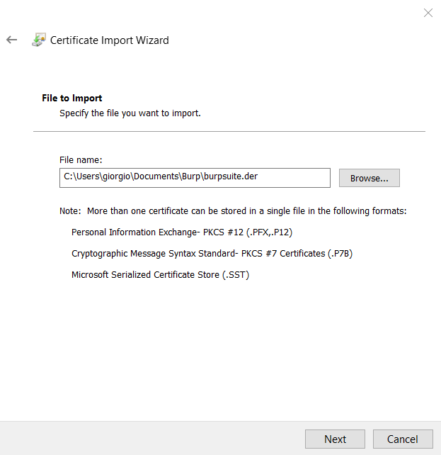

# Objective
Install BurpSuite on Windows 10 and configure it on Google Chrome

# Useful Links
* [https://portswigger.net/burp/communitydownload](https://portswigger.net/burp/communitydownload)

# Installing BurpSuite
Go to the official website [https://portswigger.net/burp/communitydownload](https://portswigger.net/burp/communitydownload). This page asks us to enter our email, but it's not necessary. Click on `Go straight to download`, and you will arrive at this screen:

Here, select `Community Edition` (the open-source version). At the moment, the latest version is `2024.6.6`. Click `Download` to get the installer. Then proceed with the installation.

When you open the software, two default tabs are shown. Click `Next` on both, and you will reach the main screen which looks like this:

The main tool of BurpSuite is located in the `Proxy` section:

From here, by going to `Settings`, you can see the IP
that BurpSuite uses as a proxy (in this case, it would be `127.0.0.1:8080`):

Now that we have correctly installed BurpSuite, we need to understand how to configure it to make it work.

# Case 1: Unable to Intercept Requests
Try to intercept the traffic. Turn `ON` the `Intercept` option in the `Proxy` section:

Now perform a search from the browser at [https://portswigger.net/burp/communitydownload](https://portswigger.net/burp/communitydownload).
Notice that the search completes successfully, meaning you get a response from the browser. However, nothing appears in BurpSuite, i.e., we are not intercepting the traffic.

This happens because we are not yet redirecting the traffic to BurpSuite's proxy.

# Case 2: Intercepting Requests but Not Getting Responses
To redirect traffic, we need to go to Windows settings via the following path: `Network and Internet > Proxy`. Here, turn `OFF` the options `Automatically detect settings` and `Use setup script`. Then turn `ON` the option `Use a proxy` server and set the BurpSuite proxy address:

**Warning**: Every time you switch from `OFF` to `ON`, you must click `Save`, otherwise the system will continue not to redirect the traffic.

Now, try intercepting the traffic again. Turn on Intercept, and then perform the search from the browser. You will notice that the browser gives a security error:

This means we are no longer getting a response from the browser. However, we see that we are intercepting the request with BurpSuite:

So we are successfully redirecting the traffic.

# Configuring Chrome
In the previous section, we did not get a response from the browser because it does not recognize the proxy address as secure. Therefore, we need to import the CA associated with BurpSuite's proxy into our browser. Let's see how to do this in Chrome.

## Export CA from BurpSuite
First, we need to export the CA from BurpSuite. To do this, go to the `Proxy` section and click on `Settings`:

Here, click on `import/export CA certificate`:

Select the option to export in `.der` format. We exported it to the directory shown on screen:

**Warning**: The file should not already exist; it is created by BurpSuite at the moment.

After exporting it, you can open it in the directory. Opening it, you can see that the certificate's issuer is PortSwigger:

## Import CA into Chrome
Now, we need to import the CA into our version of Google Chrome. To do this, go to Chrome settings via the path `Privacy and Security > Security > Manage Certificates > Trusted Root Certification Authorities`:

Here you can see all the CA certificates saved in your version of Chrome. Click `import` and select the CA we just exported:

**Warning**: To select the file, make sure to choose the `All files` option; otherwise, it will not be shown because it is in `.der` format.

After importing it, you can find it in the list of CA certificates under PortSwigger.

# Case 3: Intercepting Requests and Getting Responses

Now that we have configured the browser, try performing the search again. You will notice that the security error no longer appears, but the browser loads the page indefinitely:

This means we are still not getting a response. To get it, you need to go through all the intercepted requests in BurpSuite. From the `Proxy` section, click `Forward` to go through all the requests until the page in the browser loads:

At this point, we have successfully installed and configured BurpSuite and are ready to use it.

Warning: When you finish using BurpSuite, remember to turn the proxy `OFF` in the Windows options. Otherwise, when you perform a search from the browser with BurpSuite closed, you will not get any response:

