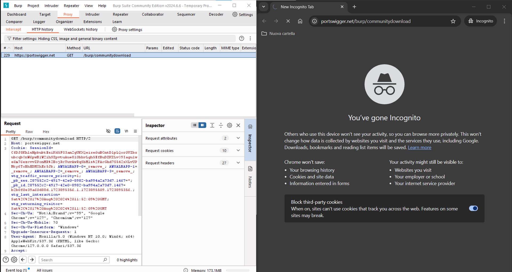
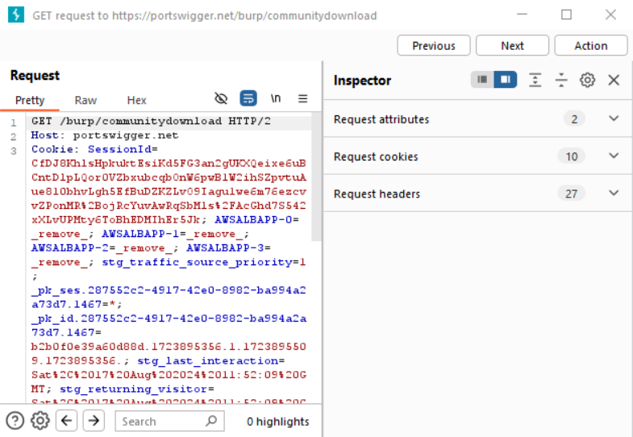
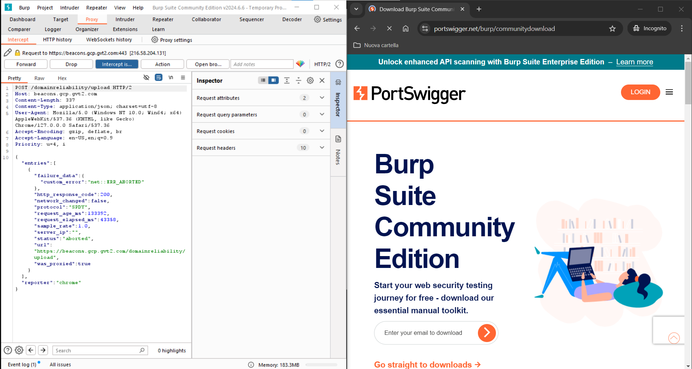

# Objective
Read HTTP scripts of browser searches (requests and responses) from BurpSuite

# Useful Links
* [https://portswigger.net/burp/communitydownload](https://portswigger.net/burp/communitydownload)

# Main
Start intercepting traffic with BurpSuite. Then perform a search from the browser at [https://portswigger.net/burp/communitydownload](https://portswigger.net/burp/communitydownload). As explained in [/main/installation](https://github.com/enricomaiolo/burpsuite/tree/main/installation), it is normal for the browser to start loading the page indefinitely:

From BurpSuite, we can see that the request has been intercepted. In the `Proxy` section, go to the `HTTP history` subsection. Here, you can see all the requests that have been intercepted:

By selecting a record, you can read the HTTP script of the request at the bottom. Opening the record (by double-clicking), you can see that this request is not associated with any response:

As we saw in [/main/installation](https://github.com/enricomaiolo/burpsuite/tree/main/installation), to make the page load, you need to go through all the requests by pressing `Forward`. By doing this, you get a response from the browser:

If you now return to the previous record, opening it shows also the HTTP script of the response:

