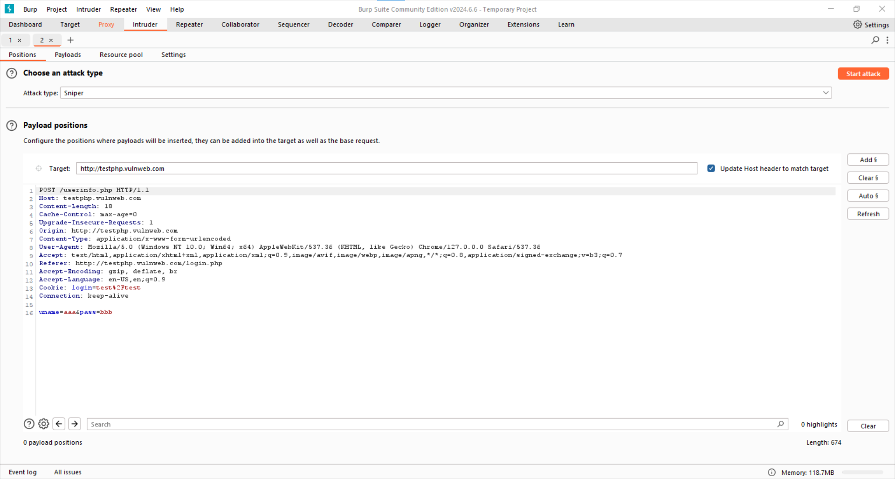
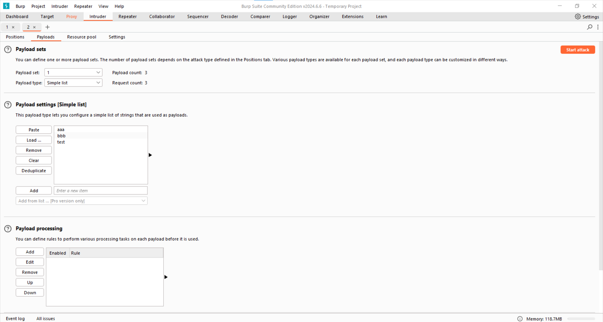

# Objective
Use BurpSuite's `Intruder` tool to perform Brute Force attacks

# Useful Links
* [http://testphp.vulnweb.com/login.php](http://testphp.vulnweb.com/login.php)

# Main
`Intruder` is a very useful tool in BurpSuite that allows you to send multiple HTTP requests in an automated way. To use it, you need to parameterize a part of the request script. `Intruder` will then make a series of requests by iterating through a range of values within a payload.

To obtain a template of the HTTP request, perform a login attempt at [http://testphp.vulnweb.com/login.php](http://testphp.vulnweb.com/login.php), as we did in [/main/repeater](http://testphp.vulnweb.com/login.php):

Now send this script to `Intruder` by clicking `Action > Send to Intruder`:

In the `Intruder` section, you will find the HTTP request:

The parts of the text that are parameterized are delimited by section signs `§`. You can add section signs to the text by clicking `Add §`. Set the username as parameterized, and fix the password to the correct value, which is `test`:

In the `Payloads` subsection, you can attach the wordlists from which you want `Intruder` to read:

We inserted three values: `aaa, bbb, test`

Now you can proceed with the attack by clicking `Start Attack`:

You will see a request for each value inserted as a payload. By clicking on the record, you can read the request and the response. You can see that the third record, having the correct credentials `test:test`, has a response of a different length than the other two.