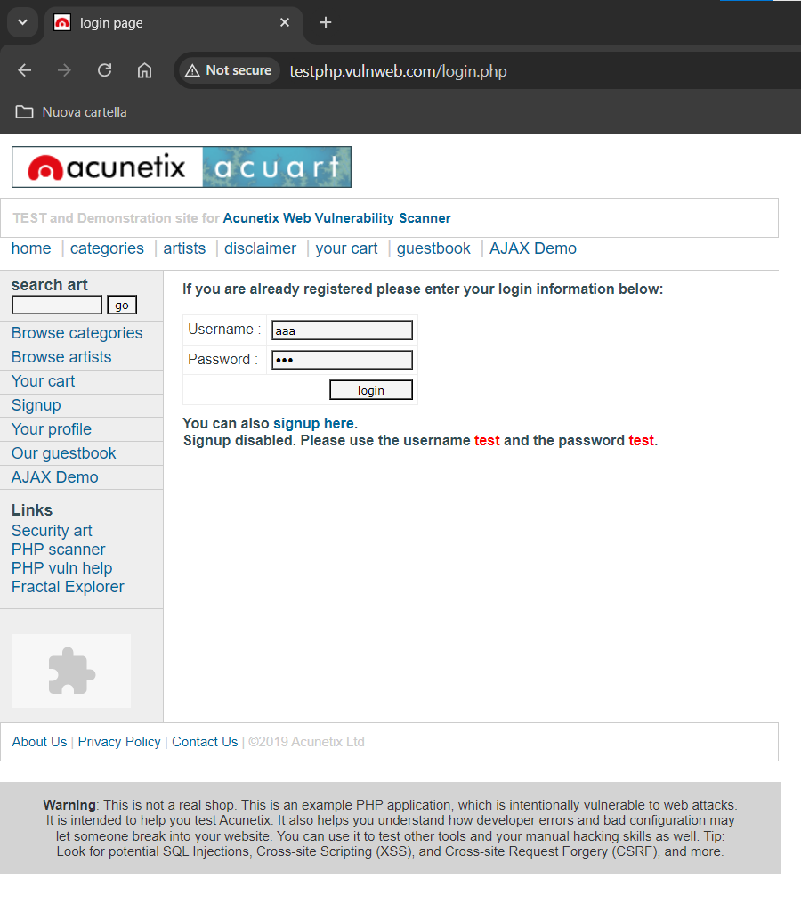
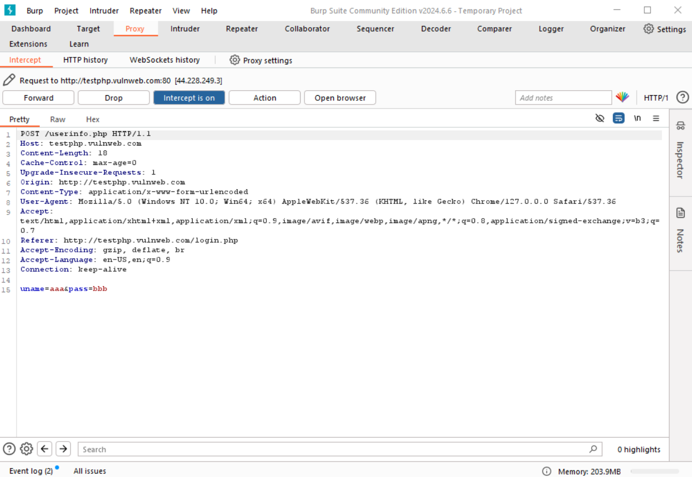
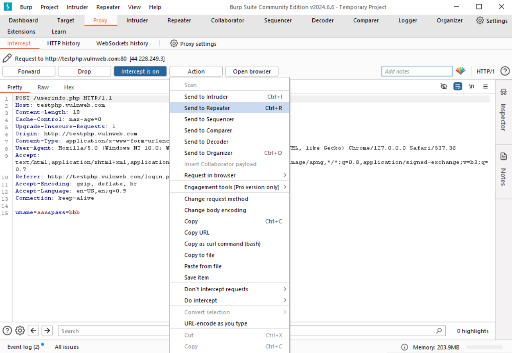
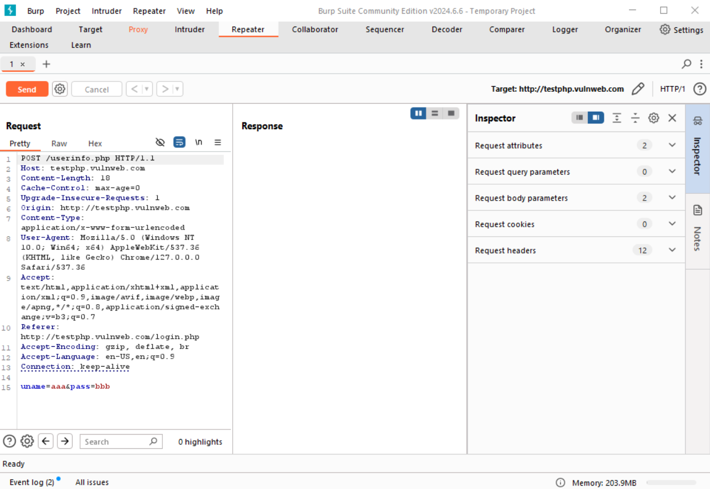
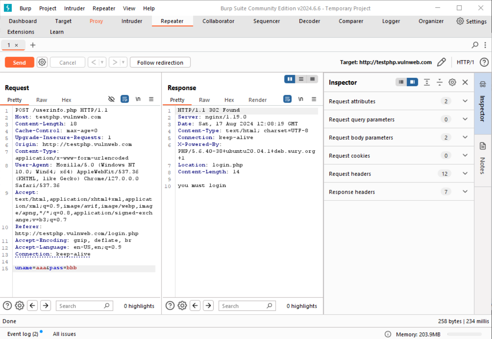
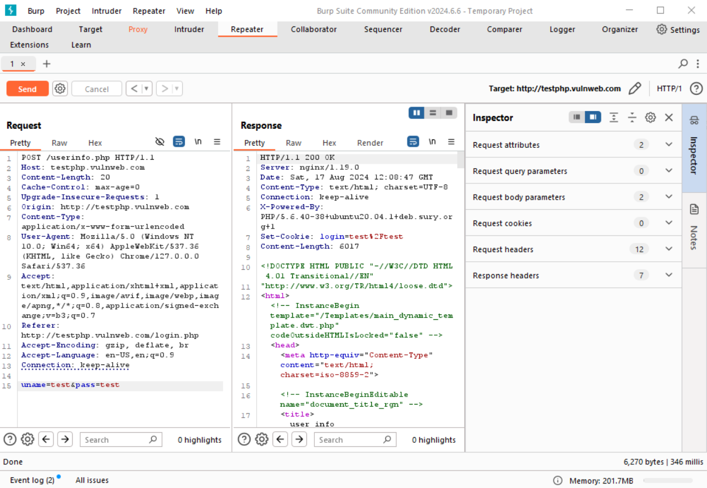
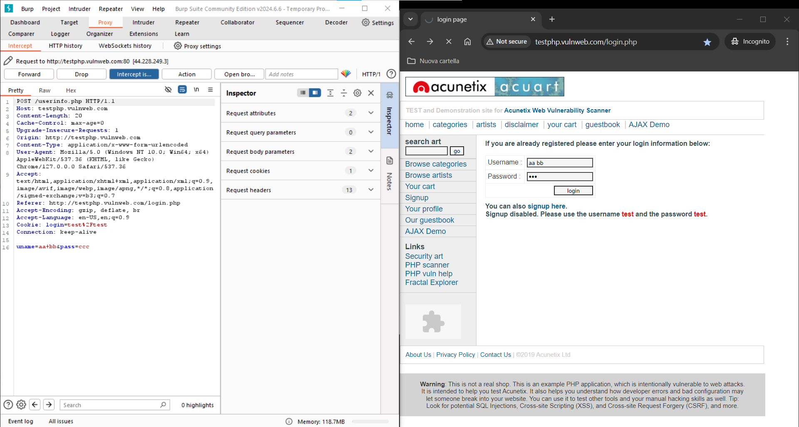

# Objective
Utilize BurpSuite's `Repeater` tool to send HTTP requests without using the browser

# Useful Links
* [http://testphp.vulnweb.com/login.php](http://testphp.vulnweb.com/login.php)

# Main
BurpSuite allows you to send HTTP requests to websites without using the browser. To do this, go to the `Repeater` section of BurpSuite and insert the HTTP request script. In this section, you can also view the response from the site.

Start by intercepting a request from the browser to obtain a template of the HTTP script. The intercepted request is a login attempt at [http://testphp.vulnweb.com/login.php](http://testphp.vulnweb.com/login.php). The credentials entered are intentionally incorrect `aaa:bbb`:

Find the request in BurpSuite's `Proxy` section:

In the script, you’ll see the credentials entered from the browser `aaa:bbb`. Now click `Action > Send to Repeater`:

In the `Repeater` section, you will find the request script:

At this point, you can send HTTP requests to the website directly from BurpSuite by clicking `Send`. Doing this will also show the response from the website:

You can manually modify the request. Try entering the correct credentials `test:test`. Notice that in this case, the response from the website is different:

# URL Encoding
Attention must be paid to the syntax used in requests sent with `Repeater`. While in the browser we directly fill out the forms, in BurpSuite you need to modify the request script, so you must adhere to URL Encoding syntax.

For example, if you enter credentials `aa bb:cc` in the browser, they will be encoded in the script as `aa+bb:cc`:

